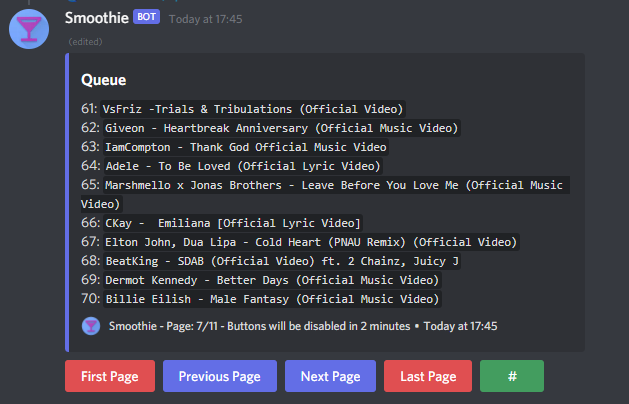

# Smoothie - a discord music bot :musical_note:

A discord music bot that uses discord.js v13 to program. For personal use only. Only suitable for a guild with a small group of friends.

Give a :heartbeat: and :star: if this bot helps!

## Feature Highlight :rotating_light:

-   Auto rejoin the voice channel when there is a server update / server crashes (Heroku will restart the server every 24 hours).
-   Auto pause and unpause when there is no one in the voice channel / someone joins the voice channel.
-   Support both slash command and prefix command! (default: `$`).

## Commands :keyboard:

| Command          | Description                                                                                                                                                                                                                     |
| ---------------- | ------------------------------------------------------------------------------------------------------------------------------------------------------------------------------------------------------------------------------- |
| clear            | Clears the queue except the music that is currently playing.                                                                                                                                                                    |
| join             | Joins your voice channel. If there is something in the queue, the music will be automatically played.                                                                                                                           |
| leave            | Leaves your voice channel.                                                                                                                                                                                                      |
| play             | Queues the music with the provided Youtube URL. Can either be a single music or a playlist URL. If `play_now` is `True` and the URL is an music, the music will play immediately. `play_now` has no effect on playlist.         |
| playloopplaylist | Queues the playlist where the URL is specified on environment variable `LOOPPLAYLISTURL`. The purpose of this command is to avoid copying and pasting the playlist URL where you and your friends save your favourite music on. |
| queue            | Shows the queue.                                                                                                                                                                                                                |
| shuffle          | Shuffles the queue.                                                                                                                                                                                                             |
| skip             | Skips the current music.                                                                                                                                                                                                        |
| lyrics           | Attempts to get the lyrics of the currently-playing song from [Genius](https://genius.com/) (may takes some time to load).                                                                                                      |
| description      | Gets the Youtube description of the currently-playing music.                                                                                                                                                                    |
| prefix           | Change / Show the prefix of your guild (Default: `$`).                                                                                                                                                                          |

## How to install :computer:

1. Clone the source code.
2. Install all the required dependancies and other stuff (e.g. Node.js >=16.6.0) (`npm install`).
3. Create a new bot in discord develop portal.
4. In `configs.json` file, change the value of `useMongoDB` to `false` if you not going to use MongoDB. (In Heroku, you need to setup mongoDB in order to permenantly store the data (e.g. queue list, auto rejoin when Heroku restarts). Otherwise the data will be wiped every 24 hours).
5. Add a `.env` file at the root folder which stores your environment variables' value.

    | Variable          | Description                                                                                                          |
    | ----------------- | -------------------------------------------------------------------------------------------------------------------- |
    | `CLIENTID`        | the clientid which can be found on discord develop portal.                                                           |
    | `TOKEN`           | the bot tocket which can be found on discord develop portal.                                                         |
    | `MYUSERID`        | Your discord user id.                                                                                                |
    | `TESTGUILDID`     | the id of your guild.                                                                                                |
    | `LOOPPLAYLISTURL` | the URL of a playlist which you want to play via /playloopplaylist.                                                  |
    | `MONGODBURL`      | the URL of MongoDB that links to your database (More detail below). If you not gonna use it, you can leave it blank. |

6. Run `npm start`. The bot should up in running right now!

## How to run the bot 27/4 :watch:

Remark: Since Heroku filesystem is ephemeral (any changes to the filesystem whilst the dyno is running only last until that dyno is shut down or restarted) and the dyno will restart every 24 hours for free dyno, setting up MongoDB is recommanded so the queue can be saved and auto reconnect will work properly.

#### If you wanna save the data premenently register a MongoDB Altas account first. Skip this part if you don't care about saving the data.

1. Register a [MongoDB Altas](https://www.mongodb.com/cloud/atlas/register) account.
2. Create a cluster.
3. On `Databases` tab, click `Browse Collections`.  
   
4. Click `Add My Own Data`.
5. Create a database named `smoothie` and collection named with `guilds`.  
   
6. On the left, click `Database Access`. Then click `ADD NEW DATABASE USER`.
7. Click `Password` as `Authentication Method` and type in `user` (e.g. `user1`) and password (e.g. `user1234`) (Use more secure password!). Click `Read and write to any database` in `Build-in Role` and finally click `Add User`.
8. On the left, click `Network Access`. Then click `ADD IP ADDRESS`.
9. Type in `0.0.0.0/0` in `Access List Entry` and `All` in `Comment` and click `Confirm`. This will enable Heroku to access your database. (`0.0.0.0/0` will able all IP to access you database).
10. Go to `Databases` page and click `Connect` in your cluster tab.  
    
11. Click `Connect your application`.
12. Choose the `DRIVER` as `Node.js` and `VERSION` as `4.0 or later`.
13. Copy the URL in step 2.
14. Replace `<password>` with the password you just entered (e.g. `user1234`) and replace `<username>` with the user you just eneter (e.g. `user1`). Replace `myFirstDatabase` with the name of the database (i.e. `smoothie` if you are following the guide).
15. The URL will be the value of the environment variable `MONGODBURL`!
16. Now you can setup Heroku!

#### Hosting on Heroku

1. Push the code to your private repository on Github. Do not push the `.env` for security reason.
2. Register an account in [Heroku](https://id.heroku.com/login).
3. Create a new app.
4. Click Github as your deployment method.
5. Link your Github account to Heroku.
6. Choose the repository that you just pushed to Github. Wait for the word "the app was successfully deployed".
7. Go to `Resources` tab. In `Free Dynos` section, disable `web` and turn on `Worker`.
8. Go to `Settings` tab. Click `Reveal Config Vars`. Put all the environment variables and its values here. If you do not need MongoDB, you can ignore the `MONGODBURL`.
9. On right hand corner, click `More` and then click `Restart all dynos`.
10. Click `More` once again and click `View logs`. You should see the bot has been successfully hosted! Congratulations!

## TODO :scroll:

-   Add alias to commands.
-   Add swap, pause, resume commands.

## Bug :lady_beetle:

-   Sometimes you playing now message will pop twice when the first music is played.
