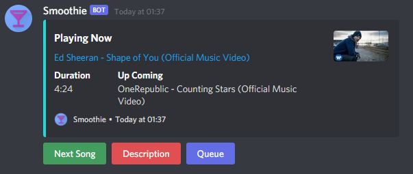

# Smoothie - a discord music bot :musical_note:

A discord music bot that uses discord.js v13 to program. For personal use only.

Give a :heartbeat: and :star: if this bot helps!

## Feature Highlight :rotating_light:

## Commands :keyboard:

| Command          | Description                                                                                                                                                                                                                     |
| ---------------- | ------------------------------------------------------------------------------------------------------------------------------------------------------------------------------------------------------------------------------- |
| clear            | Clears the queue except the music that is currently playing.                                                                                                                                                                    |
| join             | Joins your voice channel. If there is something in the queue, the music will be automatically played.                                                                                                                           |
| leave            | Leaves your voice channel.                                                                                                                                                                                                      |
| play             | Queues the music with the provided Youtube URL. Can either be a single music or a playlist URL. If `play_now` is `True` and the URL is an music, the music will play immediately. `play_now` has no effect on playlist.         |
| playloopplaylist | Queues the playlist where the URL is specified on environment variable `LOOPPLAYLISTURL`. The purpose of this command is to avoid copying and pasting the playlist URL where you and your friends save your favourite music on. |
| queue            | Shows the queue.                                                                                                                                                                                                                |
| shuffle          | Shuffles the queue.                                                                                                                                                                                                             |
| skip             | Skips the current music.                                                                                                                                                                                                        |

## How to install :computer:

1. Clone the source code.
2. Install all the required dependancies and other stuff (e.g. Node.js >=16.6.0) (`npm install`).
3. Create a new bot in discord develop portal.
4. Add a `.env` file at the root folder which stores your environment variables' value.

   | Variable          | Description                                                         |
   | ----------------- | ------------------------------------------------------------------- |
   | `CLIENTID`        | the clientid which can be found on discord develop portal.          |
   | `TOKEN`           | the bot tocket which can be found on discord develop portal.        |
   | `MYUSERID`        | Your discord user id.                                               |
   | `TESTGUILDID`     | the id of your guild.                                               |
   | `LOOPPLAYLISTURL` | the URL of a playlist which you want to play via /playloopplaylist. |

5. Deploy commands to your guild (immediate effect) and gobally (takes up to an hour) by running `npm run deploycmd`.
6. Run `npm start`. The bot should up in running right now!

## How to run the bot 27/4 :watch:

1. Push the code to your private repository on Github. Do not push the `.env` for security reason.
2. Register an account in Heroku.
3. Create a new app.
4. Click Github as your deployment method.
5. Link your Github account to Heroku.
6. Choose the repository that you just pushed to Github. Wait for the word "the app was successfully deployed".
7. Go to `Resources` tab. In `Free Dynos` section, disable `web` and turn on `Worker`.
8. Go to `Settings` tab. Click `Reveal Config Vars`. Put all the environment variables and its values here.
9. On right hand corner, click `More` and then click `Restart all dynos`.
10. Click `More` once again and click `View logs`. You should see the bot has been successfully hosted! Congratulations!

## TODO :scroll:

- Add alias to commands.
- Add swap, pause, resume commands.
- Add message line command (alongside with slash command).

## Bug :lady_beetle:

- Sometimes the music will get error while switching music or midway (hard to fix).
